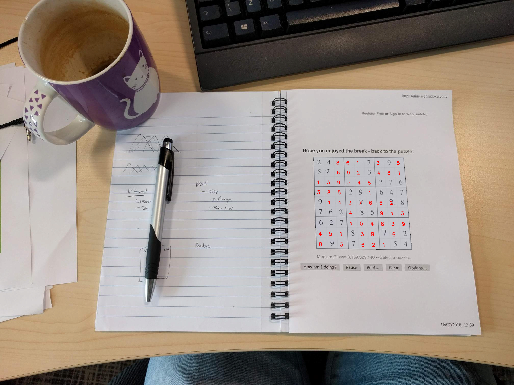
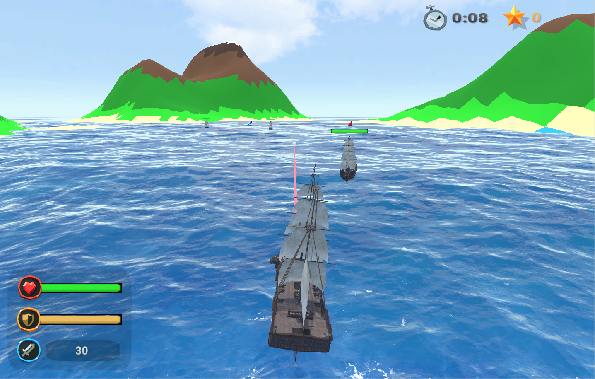
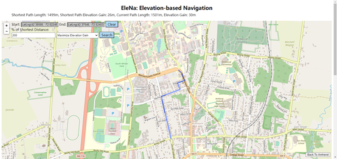
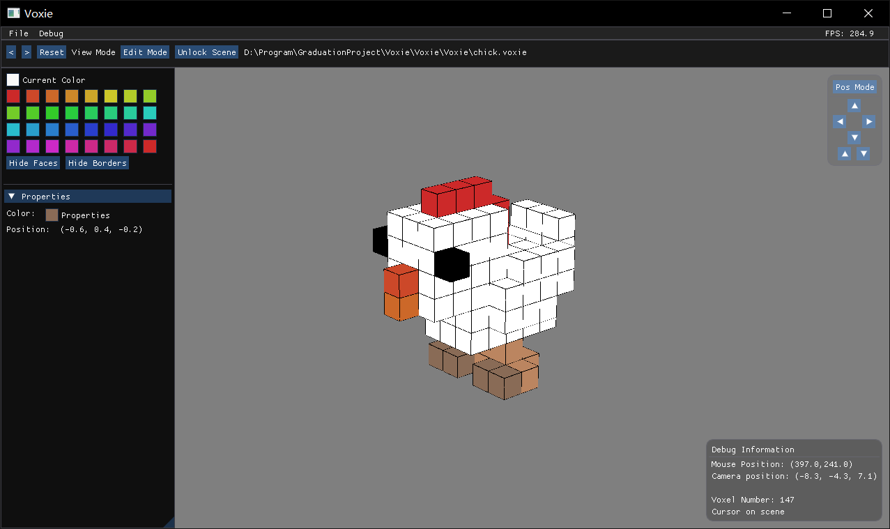

Email: yncxlzy **at** gmail **dot** com  
[CV](/files/ZhiyiLai_CV_EN.pdf) | [简历](/files/ZhiyiLai_CV_ZH.pdf) | [Github](https://github.com/L4zyy)

I am currently a Computer Science master's student at [UMass Amherst](https://www.umass.edu/).
Prior to joining UMass Amherst, I obtained my bachelor's degree in Computer Science and Technology from [Huazhong University of Science & Technology (HUST)](http://english.hust.edu.cn/).

## Research Interest

* 3D Vision
* Human Pose and Shape Estimation
* Video Compression

## Research Experiments

### Consistent VIBE [[Code](https://github.com/L4zyy/CVIBE)|[PDF](/files/CVIBE.pdf)]
Sep 2020 - Dec 2020

· Analyze the output and performance of the VIBE(Video Inference for Human Body Pose and Shape
Estimation) model.
· Propose a consistent loss and Analyze the effects of this loss on the model.
· Replace the GRU module with transformer encoder layers, which shows a performance improvement.

### The Use of Transformer in Object Detection Tasks [[Code](https://github.com/L4zyy/detr)|[PDF](/files/Transformer.pdf)]
Sep 2020 - Dec 2020

· Analyze the performance of DETR model and traditional Faster RCNN model on different datasets.
· Compare the output distributions of DETR model and Faster RCNN model on COCO dataset.
· Propose several modifications to the DETR model.
· Implement a TPU version of DETR model.

## Projects

### Deep Sudoku Solver
An image to image Sudoku solving pipeline using CNN for image segmentation and OCR(Optical character recognition).[[Code](https://github.com/L4zyy/Sudoku_Solver)|[PDF](/files/Sudoku_Solver.pdf)]

### Sea Warfare
A Third-Personal Shooting sea war survival game made with Unity 3D. The player will control a ship running on a unknown sea. In the way, he will suffer attack from hostile ships and some unknown emergencies. What he needs to do is to defeat these enemies and survive as long as possible.

### EleNA
A navigation systems optimize for the shortest or fastest route.[[Code](https://github.com/L4zyy/Elena)]

### Voxie
A simple voxel editor powered by OpenGL and [ImGui](https://github.com/ocornut/imgui).[[Code](https://github.com/L4zyy/Voxie)]

